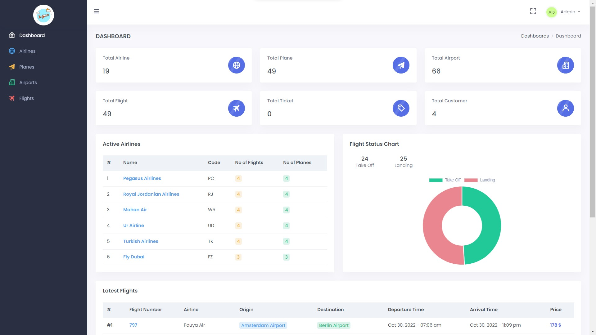
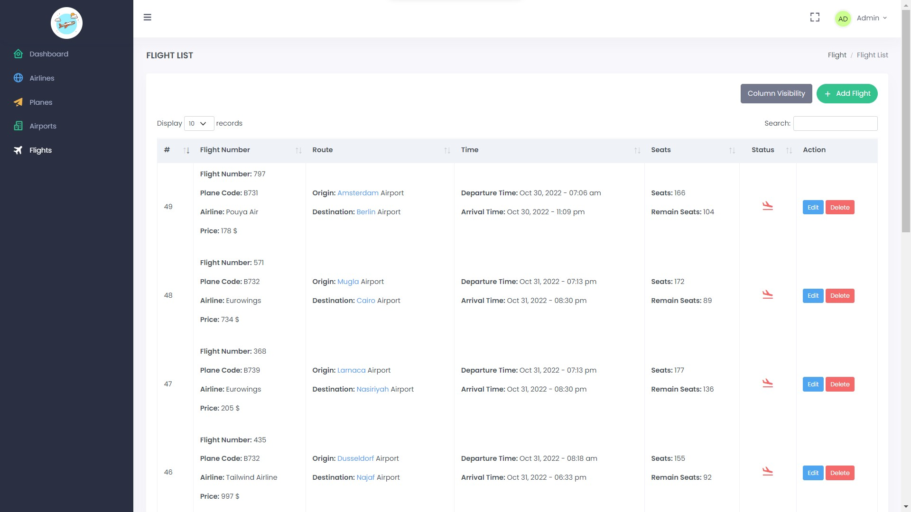
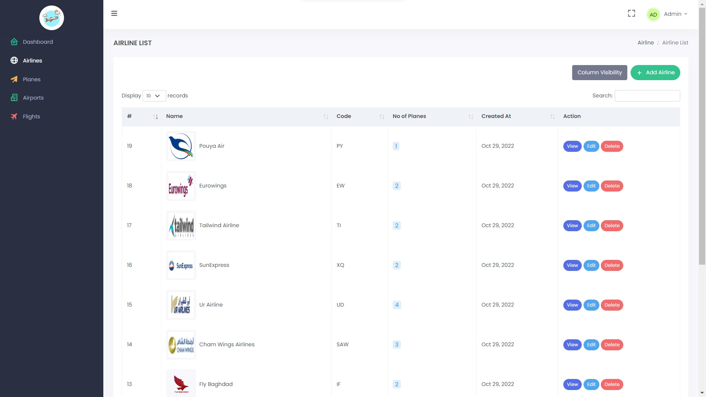

# Larevel Airline Reservation System
 - User can search for flights and book it.
 - admin in dahboard mange the flights, airlines, airports ... 
## Demo 
 - Dashbaord 
 
 - Flights 
 
 - Airlins 
 

## Installation

1. clone the project `git clone `
2. create a file with name .env `touch .env`
3. copy content of .env.example to .env
4. set up your database connection in .env
5. run `composer install`
6. generate app key `php artisan key:generate`
7. run `php artisan migrate --seed` (note --seed will fill the database with dummy data)
8.  your are good to go 😊

## Usefull Commands

- create controller with its related model + resourse functions  
    `cntrl UserController --model=User -r` for normal controller  
    `cntrl UserController --model=User --api` for normal api controller

